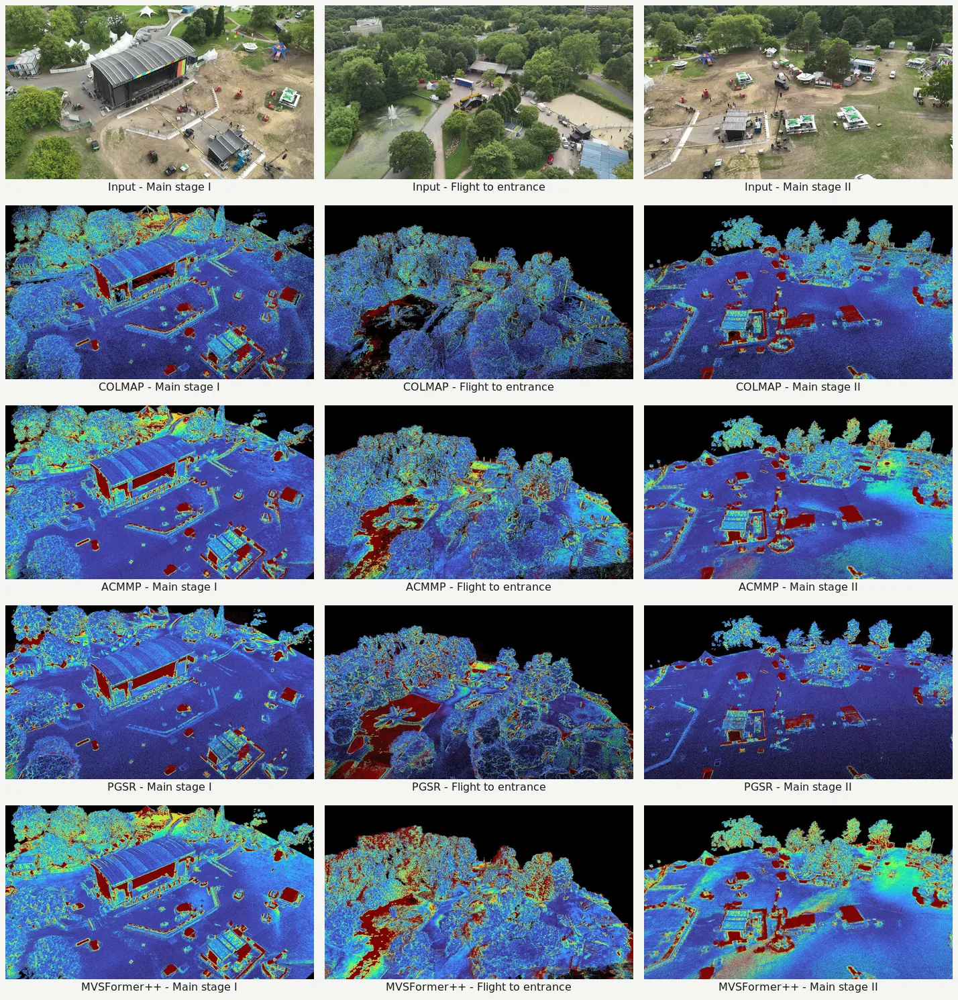

# JB3D: An Aerial Video Dataset With Per-Frame Camera Poses and LiDAR Ground Truth for Multi-View Stereo and Novel View Synthesis Benchmarking

Image-based 3D reconstruction from unmanned aerial vehicles is crucial for many applications like navigation, environmental monitoring, or creating digital twins. However, real-world aerial footage introduces unconstrained motion, scale variation, and dynamic elements that challenge current methods. Existing benchmarks address many of these aspects while providing valuable LiDAR ground truth, but only a few ground-based benchmarks provide video data with camera poses, often operating at lower frame rates or lower image resolutions, and most aerial benchmarks primarily offer still images only. To address this issue, we introduce JB3D: an aerial video dataset designed for benchmarking multi-view stereo and novel view synthesis approaches in realistic outdoor environments. Captured over the course of a two-day outdoor festival featuring challenging scenery, including fine structures and dynamic elements such as moving cars and people, JB3D comprises 14 UAV videos at 30 FPS, five LiDAR scans, and high-resolution RGB and thermal infrared images. To accurately reflect real-world operating conditions such as infrastructure monitoring, crowd counting, or supporting emergency response forces, all flight trajectories for video acquisition were controlled manually. All data are registered in a single ECEF/ENU coordinate frame. The novelty compared to other benchmark datasets relates to the per-frame camera poses, for which reference data are provided, too. They enable reconstruction from individual sequences, multi-sequence evaluation, and cross-day change detection. Alongside baseline results from conventional, learning-based, and advanced scene representation approaches, we release evaluation and visualization routines. In addition, we provide insights into how the strengths and weaknesses of chosen evaluation metrics affect the outcome by employing established metrics such as L1-abs, F1-score, and Chamfer distance.

Paper link: forthcoming

If you use JB3D in your research, please cite:

```bibtex
@unpublished{hermann_jb3d,
	author  = {Hermann, M. and B{\"o}hmer, D. and Hinz, S. and Weinmann, M.},
	title   = {JB3D: An Aerial Video Dataset With Per-Frame Camera Poses and LiDAR Ground Truth for Multi-View Stereo and Novel View Synthesis Benchmarking},
	note    = {Accepted manuscript; publication details forthcoming}
}
```

Dataset link: forthcoming

https://github.com/user-attachments/assets/20d9ccca-7406-471f-84e0-b674c9c80260

## Dataset Overview

| Property | JB3D |
| --- | --- |
| Georeferenced videos | 19 |
| Benchmark sequences | 14 |
| Listed video frames | 46,439 |
| Video resolution and frame rate | 3840 x 2160 at 30 FPS |
| RGB still images | approximately 5,000 |
| Thermal still images | approximately 3,000 |
| LiDAR point clouds | 5 |
| Acquisition period | 2 days |
| Approximate area | 650 x 750 m |
| Coordinate frame | global ECEF translation with local ENU coordinates |

The 14 benchmark sequences contain 36,752 frames. Five additional georeferenced videos contain 9,687 frames and are provided as challenging sequences or additional material outside the LiDAR evaluation coverage.

## MVS Point Cloud Benchmark

The current release compares four reconstruction approaches:

- [COLMAP](https://github.com/colmap/colmap)
- [ACMMP](https://github.com/GhiXu/ACMMP)
- [MVSFormer++](https://github.com/maybeLx/MVSFormerPlusPlus)
- [PGSR](https://github.com/zju3dv/PGSR), evaluated through geometry extracted from its 3D Gaussian representation

Across all scenes, the reconstructed point clouds are cropped using scene-specific polygons, and voxel downsampling is applied at a resolution of 2.5 cm. Completeness, precision, and F1 use a threshold of 5 cm. L1-abs and RMSE are calculated using the best 90 percent of estimate-to-reference nearest-neighbor distances, while the Chamfer distance includes both directed distances between the point clouds.

### Quantitative Results

The complete results are also available as [machine-readable CSV](docs/mvs_pointcloud_results.csv). Completeness is reported as a fraction, F1 as a percentage, and all distance metrics in meters. Point counts are measured after cropping and before voxel downsampling. End-to-end runtimes were measured on one NVIDIA L40 GPU.

<details>
<summary><strong>Day 1 results</strong></summary>

| Scene | Method | Cpl. | L1-abs (m) | RMSE (m) | CD (m) | F1 (%) | Points | Runtime (min) |
| --- | --- | --- | --- | --- | --- | --- | --- | --- |
| Main stage I | COLMAP | 0.3749 | 0.0877 | 0.1131 | 0.4875 | 36.50 | 30,442,580 | 191 |
| Main stage I | ACMMP | 0.4598 | 0.0757 | 0.0953 | 0.4970 | 42.80 | 105,904,717 | 151 |
| Main stage I | PGSR | 0.2991 | 0.1271 | 0.1771 | 0.5876 | 29.74 | 104,186,194 | 320 |
| Main stage I | MVSFormer++ | 0.6622 | 0.0969 | 0.1195 | 0.4320 | 39.26 | 1,227,616,695 | 180 |
| Main stage II | COLMAP | 0.5175 | 0.0759 | 0.0997 | 0.2986 | 47.21 | 32,433,389 | 265 |
| Main stage II | ACMMP | 0.6219 | 0.0641 | 0.0807 | 0.2809 | 54.51 | 116,476,716 | 169 |
| Main stage II | PGSR | 0.4557 | 0.1029 | 0.1487 | 0.4026 | 42.11 | 58,215,170 | 329 |
| Main stage II | MVSFormer++ | 0.8374 | 0.1003 | 0.1282 | 0.2689 | 42.76 | 1,317,229,956 | 101 |
| Flight to entrance | COLMAP | 0.0940 | 0.0978 | 0.1251 | 0.8916 | 14.38 | 11,843,414 | 115 |
| Flight to entrance | ACMMP | 0.1238 | 0.1056 | 0.1380 | 1.0395 | 17.49 | 24,720,215 | 69 |
| Flight to entrance | PGSR | 0.1024 | 0.1862 | 0.2675 | 1.4728 | 14.01 | 23,635,190 | 284 |
| Flight to entrance | MVSFormer++ | 0.3583 | 0.1083 | 0.1394 | 0.7607 | 31.16 | 337,194,622 | 31 |
| Entrance I | COLMAP | 0.4090 | 0.0890 | 0.1187 | 0.6081 | 38.72 | 80,629,251 | 601 |
| Entrance I | ACMMP | 0.4562 | 0.0847 | 0.1092 | 0.6039 | 40.16 | 182,198,498 | 411 |
| Entrance I | PGSR | 0.2738 | 0.2222 | 0.4353 | 1.3218 | 28.83 | 141,569,317 | 473 |
| Entrance I | MVSFormer++ | 0.6925 | 0.0954 | 0.1242 | 0.5336 | 44.15 | 1,491,293,674 | 185 |
| Second stage I | COLMAP | 0.3750 | 0.0465 | 0.0550 | 0.3417 | 45.23 | 28,656,167 | 228 |
| Second stage I | ACMMP | 0.4740 | 0.0437 | 0.0516 | 0.3495 | 53.01 | 89,421,442 | 160 |
| Second stage I | PGSR | 0.3662 | 0.0707 | 0.0956 | 0.4835 | 41.01 | 60,505,410 | 242 |
| Second stage I | MVSFormer++ | 0.7027 | 0.0608 | 0.0721 | 0.2972 | 54.06 | 1,049,621,579 | 118 |
| Garden I | COLMAP | 0.3035 | 0.0553 | 0.0663 | 0.4297 | 37.83 | 59,891,846 | 364 |
| Garden I | ACMMP | 0.3761 | 0.0532 | 0.0631 | 0.4659 | 43.39 | 147,043,957 | 273 |
| Garden I | PGSR | 0.2962 | 0.0840 | 0.1151 | 0.6390 | 34.69 | 134,458,919 | 335 |
| Garden I | MVSFormer++ | 0.6600 | 0.0683 | 0.0817 | 0.3647 | 49.52 | 1,763,536,880 | 122 |
| Food stalls I | COLMAP | 0.3668 | 0.0617 | 0.0739 | 0.3158 | 40.38 | 47,876,793 | 269 |
| Food stalls I | ACMMP | 0.4363 | 0.0589 | 0.0696 | 0.3389 | 45.00 | 120,689,162 | 177 |
| Food stalls I | PGSR | 0.3029 | 0.0988 | 0.1338 | 0.4565 | 32.56 | 128,692,188 | 332 |
| Food stalls I | MVSFormer++ | 0.7048 | 0.0760 | 0.0916 | 0.2745 | 46.99 | 1,473,521,911 | 91 |
| Garden II | COLMAP | 0.4690 | 0.0399 | 0.0453 | 0.2554 | 54.26 | 23,169,515 | 155 |
| Garden II | ACMMP | 0.5062 | 0.0402 | 0.0458 | 0.2580 | 56.44 | 60,818,422 | 102 |
| Garden II | PGSR | 0.3481 | 0.0463 | 0.0540 | 0.3195 | 43.41 | 57,297,885 | 295 |
| Garden II | MVSFormer++ | 0.7430 | 0.0468 | 0.0539 | 0.2114 | 63.90 | 748,753,837 | 48 |

</details>

<details>
<summary><strong>Day 2 results</strong></summary>

| Scene | Method | Cpl. | L1-abs (m) | RMSE (m) | CD (m) | F1 (%) | Points | Runtime (min) |
| --- | --- | --- | --- | --- | --- | --- | --- | --- |
| Main stage III | COLMAP | 0.5451 | 0.0470 | 0.0599 | 0.2177 | 57.08 | 42,993,775 | 295 |
| Main stage III | ACMMP | 0.6317 | 0.0420 | 0.0520 | 0.2307 | 63.07 | 165,977,111 | 220 |
| Main stage III | PGSR | 0.4819 | 0.0699 | 0.1014 | 0.3430 | 50.02 | 104,209,140 | 290 |
| Main stage III | MVSFormer++ | 0.7933 | 0.0634 | 0.0778 | 0.1936 | 57.14 | 1,866,996,966 | 115 |
| Entrance II | COLMAP | 0.3962 | 0.0455 | 0.0542 | 0.3808 | 47.49 | 43,033,958 | 287 |
| Entrance II | ACMMP | 0.4435 | 0.0481 | 0.0575 | 0.3830 | 49.77 | 111,911,799 | 210 |
| Entrance II | PGSR | 0.3075 | 0.0923 | 0.1422 | 0.7293 | 36.30 | 64,841,699 | 22 |
| Entrance II | MVSFormer++ | 0.6807 | 0.0642 | 0.0785 | 0.3215 | 53.61 | 1,296,364,042 | 94 |
| Entrance III | COLMAP | 0.6056 | 0.0364 | 0.0430 | 0.1726 | 64.42 | 46,578,574 | 270 |
| Entrance III | ACMMP | 0.6311 | 0.0386 | 0.0460 | 0.1800 | 64.55 | 133,270,322 | 201 |
| Entrance III | PGSR | 0.4479 | 0.0631 | 0.0924 | 0.4569 | 49.18 | 154,807,660 | 18 |
| Entrance III | MVSFormer++ | 0.8061 | 0.0502 | 0.0602 | 0.1732 | 64.95 | 1,487,794,705 | 95 |
| Second stage II | COLMAP | 0.4594 | 0.0498 | 0.0633 | 0.2257 | 50.97 | 53,761,062 | 428 |
| Second stage II | ACMMP | 0.5768 | 0.0468 | 0.0590 | 0.2336 | 58.39 | 184,737,038 | 319 |
| Second stage II | PGSR | 0.3338 | 0.0751 | 0.1035 | 0.4670 | 38.41 | 105,417,681 | 30 |
| Second stage II | MVSFormer++ | 0.7670 | 0.0678 | 0.0858 | 0.2208 | 55.91 | 1,659,169,399 | 146 |
| Food stalls II | COLMAP | 0.3318 | 0.0438 | 0.0529 | 0.2662 | 43.03 | 21,120,005 | 142 |
| Food stalls II | ACMMP | 0.4357 | 0.0404 | 0.0485 | 0.2527 | 52.01 | 58,025,449 | 102 |
| Food stalls II | PGSR | 0.2890 | 0.0690 | 0.0899 | 0.3627 | 35.42 | 35,938,100 | 15 |
| Food stalls II | MVSFormer++ | 0.7366 | 0.0558 | 0.0678 | 0.1915 | 59.75 | 695,836,374 | 50 |
| Garden III | COLMAP | 0.3188 | 0.0362 | 0.0415 | 0.3793 | 43.61 | 21,302,682 | 143 |
| Garden III | ACMMP | 0.4258 | 0.0346 | 0.0401 | 0.3601 | 53.17 | 50,513,244 | 103 |
| Garden III | PGSR | 0.3075 | 0.0523 | 0.0666 | 0.4636 | 39.60 | 36,144,080 | 12 |
| Garden III | MVSFormer++ | 0.6481 | 0.0458 | 0.0535 | 0.3122 | 60.83 | 691,210,743 | 46 |

</details>


### Qualitative Results

The first row shows exemplary input images. The following rows display the results from the evaluated methods rendered from the same perspective, with the absolute error color coded. The color scale ranges from 0 m to 0.5 m and above.




## NVS and 3D Gaussian Splatting

The NVS/3DGS benchmark is work in progress. Rendering metrics, evaluation views, baseline configurations, and quantitative results will be published after the protocol has been finalized.

## Evaluation

The evaluation tools were tested with Python 3.10. Create an isolated environment and install the pinned dependencies:

```bash
python3.10 -m venv .venv
source .venv/bin/activate
python -m pip install --upgrade pip
python -m pip install -r requirements.txt
```

The point cloud evaluation script is provided in [eval_pointcloud.py](eval_pointcloud.py). It computes completeness, L1-abs, RMSE, Chamfer distance, and F1, and can export a point cloud color coded by absolute error for qualitative inspection.

```bash
python eval_pointcloud.py --voxel_size 0.025 --completeness_threshold 0.9 --abs_error_threshold 0.05 ESTIMATED_POINT_CLOUD GROUND_TRUTH_POINT_CLOUD
```

Ground truth depth maps can be rendered with [render_depth_maps.py](render_depth_maps.py). The registered LiDAR point cloud is projected into the image plane using the provided camera poses. To ensure pixel-wise correspondence with the reconstructed depth maps, the script requires the same undistorted COLMAP model used by the evaluated MVS approach, with every camera represented as `SIMPLE_PINHOLE` or `PINHOLE`. The script writes metric float32 TIFF files while preserving the image-relative filenames. Pass `--render-rgb` to additionally write Turbo color-coded PNG files; `--rgb-depth-range MIN MAX` applies one fixed metric range across all views instead of per-view percentile scaling.

```bash
python render_depth_maps.py UNDISTORTED_COLMAP_MODEL GROUND_TRUTH_POINT_CLOUD OUTPUT_DIRECTORY
```

Reconstructed depth maps can be evaluated with [eval_depth_maps.py](eval_depth_maps.py). Inputs may be one TIFF pair or two directory trees with matching relative filenames. Relative error is reported by default; pass `--absolute-error` for metric absolute error or `--median-scale` for scale-ambiguous estimates. Estimate and ground truth dimensions must match unless `--resize-estimate` is explicitly enabled for maps with the same camera geometry. Pass `--error-map-directory ERROR_MAPS` to write Turbo color-coded PNG error maps with invalid pixels shown in black. By default, the color range extends from zero to the 99th percentile of valid errors in each map; `--error-map-range MIN MAX` applies one fixed range across all maps.

```bash
python eval_depth_maps.py --absolute-error --error-map-directory ERROR_MAPS ESTIMATED_DEPTHS GROUND_TRUTH_DEPTHS
```

## Coming Soon

- [ ] Paper release
- [ ] Dataset release with download and file-format documentation
- [ ] Novel view synthesis and 3D Gaussian Splatting (3DGS) benchmark

## Dataset Access

The approximately 50 GB dataset will be hosted outside GitHub and offered as direct downloads. The repository will contain only evaluation code, documentation, compact result tables, and selected web-resolution figures.

Download links and file-format documentation will be added with the dataset release.

## License

The evaluation code is released under the [MIT License](LICENSE). The JB3D dataset and website media are released under the [Creative Commons Attribution 4.0 International License](LICENSE-DATA.md).
